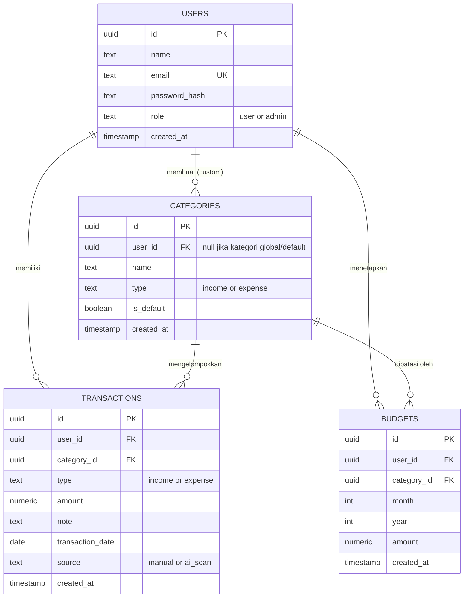

# Product Requirement Document: Pundi

**Personal Finance Tracker**

Mata Kuliah: Pemrograman Web 2 (UAS)
Versi dokumen: 1.0
Status: Final

---

## 1. Project Overview

### 1.1 Nama Aplikasi

**Pundi** - Personal Finance Tracker. Nama diambil dari istilah "pundi-pundi" (tempat
menyimpan uang / tabungan) dalam bahasa Indonesia.

### 1.2 Latar Belakang Masalah

Banyak orang kesulitan melacak ke mana uangnya pergi setiap bulan karena pencatatan
manual (buku catatan, spreadsheet terpisah) mudah terlupakan dan tidak memberi
gambaran langsung soal kebiasaan belanja. Tanpa kategori yang jelas dan batas
anggaran (budget), pengeluaran cenderung tidak terkontrol sampai baru terasa saat
saldo menipis di akhir bulan.

Pundi menjawab masalah ini dengan aplikasi pencatatan keuangan pribadi yang
sederhana: mencatat pemasukan dan pengeluaran per kategori, menetapkan budget
bulanan, dan menampilkan ringkasan visual (grafik) supaya pengguna bisa melihat pola
keuangannya secara instan.

### 1.3 Target Pengguna

- Individu (mahasiswa, pekerja) yang ingin mencatat keuangan pribadi tanpa perlu
  aplikasi finance kompleks yang terhubung ke rekening bank.
- Pengguna yang lebih nyaman dengan pencatatan manual singkat dibanding aplikasi
  finance otomatis yang terasa berat.

---

## 2. User Personas & User Flow

### 2.1 Aktor

| Aktor | Deskripsi |
|---|---|
| **User** | Pengguna terdaftar yang mencatat transaksi keuangan pribadinya sendiri. Hanya bisa melihat dan mengelola datanya sendiri. |
| **Admin** | Pengelola aplikasi. Tidak bisa melihat detail transaksi pribadi user (privasi tetap dijaga), tapi bisa memantau statistik agregat aplikasi dan mengelola kategori default global. |

### 2.2 User Flow: User (alur utama)

1. Pengguna membuka aplikasi, mendarat di halaman **Login**.
2. Pengguna baru menekan "Daftar", mengisi nama, email, dan password, lalu submit.
   Akun dibuat dan pengguna otomatis masuk (login).
3. Pengguna diarahkan ke **Dashboard**. Jika belum ada transaksi, dashboard
   menampilkan ajakan untuk menambah transaksi pertama.
4. Pengguna menekan "Tambah Transaksi", memilih tipe (income/expense), memilih
   kategori, mengisi jumlah, tanggal, dan catatan opsional, lalu menyimpan.

   **Alternatif: Scan Struk.** Alih-alih mengisi manual, pengguna menekan
   "Scan Struk" lalu memilih memotret struk lewat kamera langsung (live
   preview di dalam aplikasi) atau mengunggah foto yang sudah ada. Sistem
   mengirim foto ke layanan AI (Gemini) yang mengembalikan dugaan nama
   merchant, tanggal, total nominal, dan kategori. Hasil dugaan ini mengisi
   form "Tambah Transaksi" secara otomatis, tetapi *tidak langsung tersimpan*:
   pengguna tetap harus meninjau, mengoreksi field yang salah bila perlu, lalu
   menekan "Simpan" secara eksplisit sebelum data benar-benar masuk sebagai
   transaksi.
5. Transaksi baru langsung muncul di daftar transaksi dan ringkasan dashboard
   ter-update (saldo, breakdown kategori, grafik tren).
6. Pengguna membuka halaman **Kategori** untuk menambah kategori custom di luar
   kategori default (misalnya "Langganan Streaming").
7. Pengguna membuka halaman **Budget**, menetapkan batas anggaran bulanan per
   kategori (misalnya Rp 1.000.000 untuk kategori Makanan bulan ini).
8. Dashboard menampilkan progress pemakaian budget per kategori (indikator warna:
   hijau di bawah 70%, kuning 70-100%, merah di atas 100%).
9. Pengguna bisa mengedit atau menghapus transaksi miliknya kapan saja dari daftar
   transaksi.
10. Pengguna menekan "Logout" untuk keluar.

### 2.3 User Flow: Admin

1. Admin login dengan akun berrole `admin`.
2. Admin diarahkan ke **Admin Dashboard** (bukan dashboard finance personal),
   menampilkan statistik agregat: total pengguna terdaftar, total transaksi
   tercatat di seluruh sistem, jumlah kategori global aktif. Tidak ada detail
   transaksi/nominal milik user tertentu yang ditampilkan.
3. Admin membuka halaman **Kelola Kategori Global** untuk menambah atau
   menonaktifkan kategori default yang otomatis tersedia untuk semua user baru.
4. Admin logout.

---

## 3. Functional Requirements

| ID | Nama Fitur | Deskripsi Perilaku | Status |
|---|---|---|---|
| F01 | Registrasi Akun | User mendaftar dengan nama, email, password. Email harus unik dan valid; password minimal 8 karakter, di-hash (bcrypt) sebelum disimpan. | Wajib |
| F02 | Login | User login dengan email + password. Sistem menerbitkan JWT yang disimpan di cookie httpOnly. Kredensial salah menampilkan pesan error tanpa membocorkan apakah email atau password yang salah. | Wajib |
| F03 | Logout | Menghapus cookie sesi, mengarahkan kembali ke halaman Login. | Wajib |
| F04 | Update Profil | User dapat mengubah nama dan mengganti password (wajib konfirmasi password lama). | Opsional |
| F05 | Tambah Transaksi | User mencatat transaksi baru: tipe (income/expense), kategori, jumlah (harus lebih besar dari 0), tanggal, catatan opsional. | Wajib |
| F06 | Lihat Daftar Transaksi | Menampilkan daftar transaksi milik user dengan paginasi, dapat difilter berdasarkan tipe, kategori, dan rentang tanggal. | Wajib |
| F07 | Edit Transaksi | User dapat mengubah data transaksi miliknya sendiri. Sistem menolak permintaan edit terhadap transaksi milik user lain (otorisasi berbasis kepemilikan data). | Wajib |
| F08 | Hapus Transaksi | User dapat menghapus transaksi miliknya sendiri, dengan konfirmasi sebelum penghapusan. | Wajib |
| F09 | Kelola Kategori Custom | User dapat menambah, mengubah nama, dan menghapus kategori miliknya sendiri, selain kategori default global. | Wajib |
| F10 | Kategori Default Otomatis | Setiap user baru otomatis melihat kumpulan kategori default (misalnya Makanan, Transportasi, Gaji, Hiburan, Tagihan) tanpa perlu membuatnya sendiri. | Opsional |
| F11 | Set Budget Bulanan | User menetapkan nominal budget per kategori untuk bulan dan tahun tertentu. Satu kategori hanya boleh punya satu budget per bulan/tahun. | Wajib |
| F12 | Progress Budget | Dashboard menghitung dan menampilkan persentase pemakaian budget per kategori berjalan (total pengeluaran kategori tersebut bulan ini dibagi nominal budget), dengan indikator warna. | Wajib |
| F13 | Dashboard Ringkasan | Menampilkan total income, total expense, dan saldo bulan berjalan, serta breakdown pengeluaran per kategori dalam bentuk pie chart. | Wajib |
| F14 | Grafik Tren Bulanan | Menampilkan grafik batang/garis perbandingan income vs expense untuk beberapa bulan terakhir (default 6 bulan). | Wajib |
| F15 | Export Laporan CSV | User dapat mengunduh riwayat transaksinya dalam format CSV. | Opsional |
| F16 | Admin Dashboard | Admin melihat statistik agregat aplikasi (total user, total transaksi, total kategori global) tanpa akses ke detail data pribadi user. | Wajib |
| F17 | Kelola Kategori Global | Admin dapat menambah atau menonaktifkan kategori default yang berlaku untuk semua user baru. | Opsional |
| F18 | Scan Struk dengan AI | User memotret struk belanja lewat kamera langsung (live preview) di dalam aplikasi, atau mengunggah foto yang sudah ada. Sistem mengirim gambar ke Gemini API dan menerima kembali dugaan nama merchant, tanggal, total nominal, dan kategori dalam format terstruktur (JSON). Hasil dugaan mengisi form transaksi secara otomatis, tetapi wajib ditinjau dan dikonfirmasi user sebelum tersimpan sebagai transaksi asli (tidak ada data yang masuk tanpa konfirmasi eksplisit). | Wajib |

---

## 4. Non-Functional Requirements

### 4.1 Technology Stack

| Layer | Teknologi |
|---|---|
| Frontend | React 19 + Vite, TypeScript |
| Styling / UI | Tailwind CSS, shadcn/ui, react bits (untuk komponen animasi/interaktif) |
| Charting | Recharts |
| Backend | Vercel Functions (serverless, Node.js runtime), TypeScript |
| ORM | Drizzle ORM |
| Database | Neon Postgres (provisioning lewat integrasi Vercel Marketplace), diakses lewat Neon serverless HTTP driver |
| Validasi | Zod (dipakai di client untuk UX, dan di setiap function backend sebagai validasi wajib) |
| Autentikasi | JWT custom (jose), password hashing dengan bcrypt |
| AI (Scan Struk) | Gemini API (`@google/genai`, model `gemini-2.5-flash`), dipanggil dari backend saja, dengan `responseSchema` agar hasilnya berupa JSON terstruktur, bukan teks bebas |
| Deployment | Vercel (frontend, backend function, dan database provisioning dalam satu project) |
| Version Control | Git + GitHub |

Frontend dan backend berada dalam satu Vercel project (satu repo, satu deploy),
sehingga cookie autentikasi httpOnly bekerja tanpa masalah cross-origin karena
keduanya berada di domain yang sama.

### 4.2 Keamanan

- Password tidak pernah disimpan dalam bentuk plain text, selalu di-hash dengan
  bcrypt (cost factor >= 10) sebelum masuk database.
- Token sesi (JWT) disimpan di cookie dengan flag `httpOnly`, `secure`, dan
  `sameSite=strict`, bukan di `localStorage`, untuk mengurangi risiko pencurian
  token lewat XSS.
- Setiap input dari client divalidasi ulang di sisi server menggunakan skema Zod;
  validasi di frontend hanya untuk kenyamanan pengguna (UX), tidak pernah
  dipercaya sebagai satu-satunya lapisan keamanan.
- Semua query database menggunakan Drizzle ORM (parameterized query), tidak ada
  string SQL yang digabung manual dari input user, untuk mencegah SQL injection.
- Otorisasi berbasis kepemilikan data: setiap endpoint transaksi/kategori/budget
  memverifikasi bahwa `user_id` pada data yang diakses cocok dengan user yang
  sedang login, sebelum mengizinkan baca/ubah/hapus.
- Endpoint khusus Admin (F16, F17) diproteksi middleware otorisasi berbasis role
  (`role = admin`), terpisah dari middleware otentikasi biasa.
- Kredensial database, secret JWT, dan API key Gemini disimpan sebagai environment
  variable di Vercel, tidak pernah di-commit ke repository (`.env*` masuk
  `.gitignore`).
- API key Gemini hanya dipanggil dari backend (Vercel Function), tidak pernah
  dikirim atau ditempel ke kode frontend, supaya key tidak bisa dibaca lewat
  DevTools browser.
- Hasil ekstraksi AI dari struk (F18) selalu bersifat dugaan yang harus
  dikonfirmasi user; sistem tidak pernah menyimpan transaksi secara otomatis
  hanya berdasarkan output AI, untuk mencegah data keuangan yang salah masuk
  tanpa sepengetahuan user.

### 4.3 Performa

- Daftar transaksi menggunakan paginasi (bukan memuat seluruh riwayat sekaligus)
  untuk menjaga waktu respons tetap cepat seiring bertambahnya data.
- Kolom `user_id`, `category_id`, dan `transaction_date` pada tabel transaksi
  diberi index untuk mempercepat query filter dan agregasi dashboard.

### 4.4 Kompatibilitas

- Responsif untuk mobile dan desktop (mobile-first, karena pencatatan transaksi
  harian realistisnya dilakukan dari HP).
- Navigasi mobile memakai bottom tab bar (Dashboard, Transaksi, Budget, Lainnya)
  yang selalu terlihat; form dan dialog tampil sebagai bottom sheet yang slide-up
  dari bawah layar di mobile, sedangkan di desktop tetap berupa modal mengambang.
- Mendukung browser modern (Chrome, Edge, Firefox, Safari versi terbaru).

---

## 5. Database Schema

### 5.1 Entity-Relationship Diagram

### 5.2 Catatan Rancangan

- `categories.user_id` bernilai `null` untuk kategori default global (dibuat oleh
  Admin, F17) dan berisi id user untuk kategori custom milik user (F09).
- `budgets` punya unique constraint pada kombinasi `(user_id, category_id, month,
  year)`, sehingga satu kategori hanya punya satu budget per bulan.
- `amount` pada `transactions` dan `budgets` menggunakan tipe `numeric` (bukan
  `float`), untuk menghindari kesalahan pembulatan pada nilai uang.
- `transactions.source` menandai asal data (`manual` dari F05, atau `ai_scan`
  dari F18) untuk transparansi; kolom ini tidak memengaruhi validasi, sebab
  data hasil scan tetap melalui alur konfirmasi yang sama seperti input manual
  sebelum tersimpan. Gambar struk asli tidak disimpan permanen di database
  atau storage, hanya dikirim ke Gemini API untuk diekstrak lalu dibuang.

---

## 6. API Overview

| Method | Endpoint | Fitur terkait | Akses |
|---|---|---|---|
| POST | `/api/auth/register` | F01 | Publik |
| POST | `/api/auth/login` | F02 | Publik |
| POST | `/api/auth/logout` | F03 | User |
| GET/PUT | `/api/profile` | F04 | User |
| GET/POST/PUT/DELETE | `/api/transactions` (`PUT`/`DELETE` lewat query `?id=`) | F05-F08 | User (pemilik data) |
| GET | `/api/transactions/export` | F15 | User |
| GET/POST/DELETE | `/api/categories` (`DELETE` lewat query `?id=`) | F09, F10 | User (pemilik data untuk hapus) |
| GET/POST/DELETE | `/api/budgets` (`DELETE` lewat query `?id=`) | F11 | User (pemilik data untuk hapus) |
| GET | `/api/dashboard/summary` | F12, F13, F14 | User |
| GET | `/api/admin/stats` | F16 | Admin |
| GET/POST/PATCH | `/api/admin/categories` (`PATCH` lewat query `?id=`) | F17 | Admin |
| POST | `/api/receipts/scan` | F18 | User |
